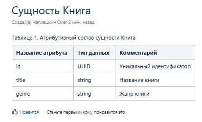
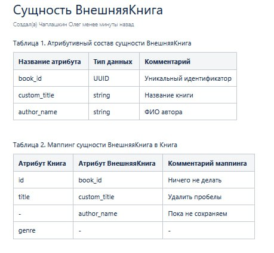
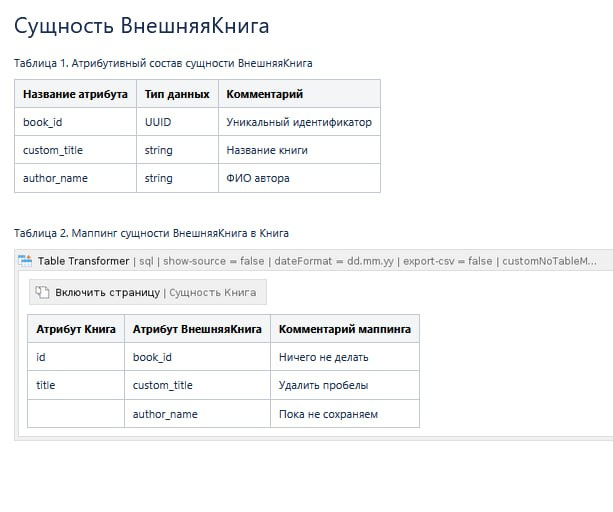
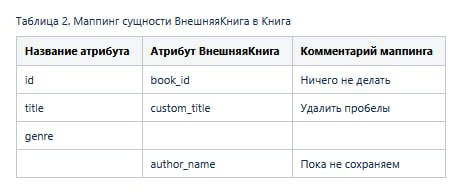
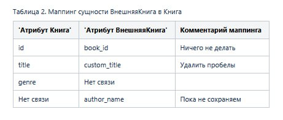
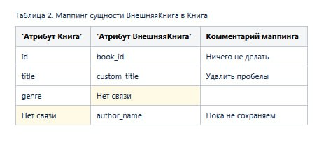
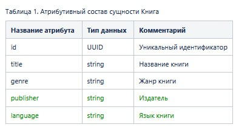
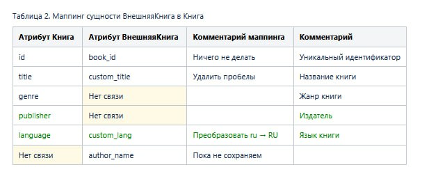

<div style="text-align: center;">
  <h1>Использование Table Transformer для маппинга</h1>
</div>

## Введение

Во время работы над контрактами или отображением(mapping) сущностей мы неизбежно используем как минимум две таблицы.

Например, опишем сущность `Книга` на одной странице в Confluence:

Таблица 1. Атрибутивный состав сущности `Книга`
| Название атрибута | Тип данных | Комментарий              |
|-------------------|------------|--------------------------|
| id                | UUID       | Уникальный идентификатор |
| title             | string     | Название книги           |
| genre             | string     | Жанр книги               |

Через некоторое время нам нужно сделать отображение внешней сущности, которая будет описана на другой странице:

Таблица 2. Атрибутивный состав внешней сущности `ВнешняяКнига`
| Название атрибута | Тип данных | Комментарий              |
|-------------------|------------|--------------------------|
| book_id           | UUID       | Уникальный идентификатор |
| custom_title      | string     | Название книги           |
| author_name       | string     | ФИО автора               |

В результате копирования таблиц получится целевая таблица примерно следующего содержания:

Таблица 3. Маппинг сущностей `ВнешняяКнига` и `Книга`
| Атрибут Книга | Атрибут ВнешняяКнига | Комментарий маппинга |
|---------------|----------------------|----------------------|
| id            | book_id              | Ничего не делать     |
| title         | custom_title         | Удалить пробелы      |
| genre         | -                    | -                    |
| -             | author_name          | Пока не сохраняем    |

Здесь зафиксирован маппинг между
- `id` <-> `book_id` (отображаем как есть)
- `title` <-> `custom_title` (с некоторой обработкой)

А также мы видим, что
- атрибута `genre` - нет в сущности `ВнешняяКнига`
- атрибут `author_name` - не будет сохранен в сущности `Книга`

## Проблематика

При изменении атрибутивного состава исходной сущности `Книга` в системе, необходимо будет провести поиск и обновление всех маппингов.

Это пораждает следующие проблемы:
- постоянное копирование исходной таблицы сущности `Книга`
- ручной сбор контента маппинга (bus-factor, т.к. только несколько сотрудников знают об отдаленных местах в Confluence)
- проблема обратного отображения: `ВнешняяКнига` может быть расширена до нового атрибута `genre`. Он есть в исходной сущности `Книга`, но требуется полное обновление всех связей

Целевая картина выглядит следующим образом:
- исходная сущность описывается в одном месте
- внешние сущности описываются также в одном месте
- при изменении исходной сущности мы не должны переживать за актуальность маппингов на нее
- при изменении внешней сущности мы должны явно увидеть:
    - отсутствие маппинга, если нового атрибута нет в исходной сущности
    - автоматическое связывание, если новый атрибут существует в исходной сущности

## Решение

Используем нативные макросы: Table Transformer и Include Page.

### Исходное состояние страниц




### Добавляем Table Transformer и Include Page



### Наполняем SQL запрос простым OUTER JOIN

```sql
select
  T1.'Название атрибута',
  T2.'Атрибут ВнешняяКнига',
  T2.'Комментарий маппинга'
from T1
outer join T2 on T1.'Название атрибута'=T2.'Атрибут Книга'
```



Уже получилось то, что необходимо. Однако нам хочется явно указать, что данных нет. Это можно сделать простым CASE expression.

### Добавляем явное отображение при отсутствии связей

```sql
select
  case
    when T1.'Название атрибута' is NULL or T1.'Название атрибута'='' then 'Нет связи'
    else T1.'Название атрибута'
  end as 'Атрибут Книга',
  T1.'Тип данных',
  case
    when T2.'Атрибут ВнешняяКнига' is NULL or T2.'Атрибут ВнешняяКнига'='' then 'Нет связи'
    else T2.'Атрибут ВнешняяКнига'
  end as 'Атрибут ВнешняяКнига',
  T2.'Комментарий маппинга',
  T1.'Комментарий'
from T1
outer join T2 on T1.'Название атрибута'=T2.'Атрибут Книга'
```



Используя FORMATWIKI можем заполнить ячейки любыми мета-данными. Например, проставим фон в светло-желтый.

### Добавляем выделение фона используя FORMATWIKI

```sql
select
  case
    when T1.'Название атрибута' is NULL or T1.'Название атрибута'='' then
        FORMATWIKI("{cell:bgColor=#fffae6}Нет связи(исходная сущность)", "{cell}")
    else T1.'Название атрибута'
  end as 'Атрибут Книга',
  case
    when T2.'Атрибут ВнешняяКнига' is NULL or T2.'Атрибут ВнешняяКнига'='' then
        FORMATWIKI("{cell:bgColor=#fffae6}Нет связи(внешняя сущность)", "{cell}")
    else T2.'Атрибут ВнешняяКнига'
  end as 'Атрибут ВнешняяКнига',
  T2.'Комментарий маппинга'
from T1
outer join T2 ON T1.'Название атрибута'=T2.'Атрибут Книга'
```



## Итоги

Если мы хотим изменить атрибутивный состав сущности "Книга", то нам достаточно это сделать в одной странице. Остальные страницы маппинга будут подсвечивать, что новый атрибут не имеет маппинга.



Если же мы хотим добавить новый атрибут "ВнешняяКнига" на уже существующий атрибут "Книга", то будет выполнено автоматическое создание связи

